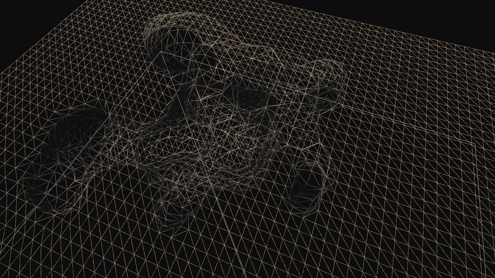
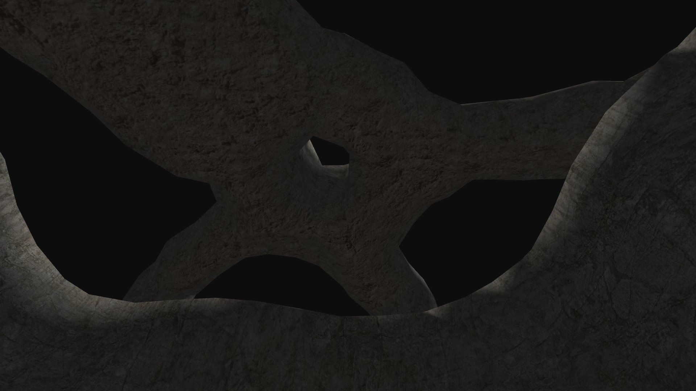
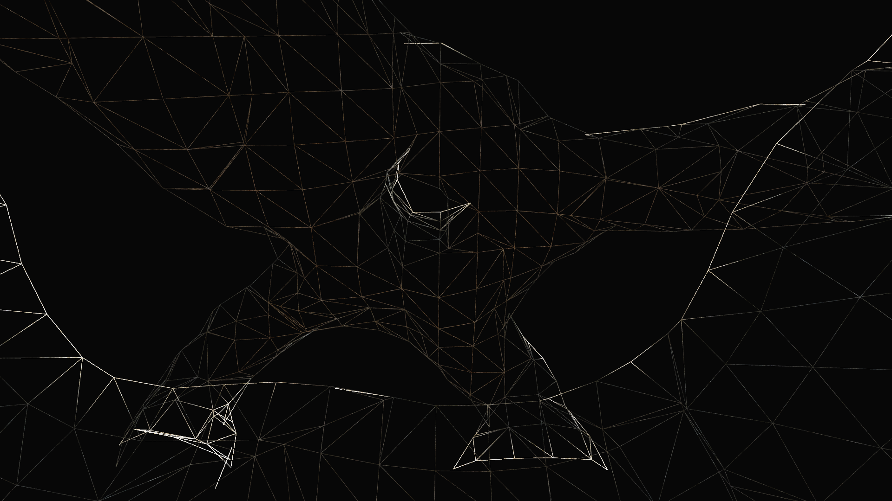

# Moonshine

Core profile OpenGL graphics engine with forward rendering pipeline

## Features
- Smooth voxel terrain
- Fast update of local terrain changes regardless of terrain size
- Scene graph
- Loading .obj models
- Fly camera

## Demo video

## Screenshots

|||
| --------------------------------- | --------------------------------- |
|   |   |
|   |   |

<!---
## Controls
- W, A, S, D - movement
- Shift - increase move speed
- Right mouse button - draw
- Left mouse button - erase
- 1/2 - increase/decrease brush radius
- Q - toggle wireframe
- E - toggle terrain smooth shading
-->

## Resources
- [GLFW](https://www.glfw.org/)
- [GLEW](http://glew.sourceforge.net/)
- [GLM](https://glm.g-truc.net/0.9.9/index.html)
- [Tiny OBJ loader](https://github.com/syoyo/tinyobjloader)
